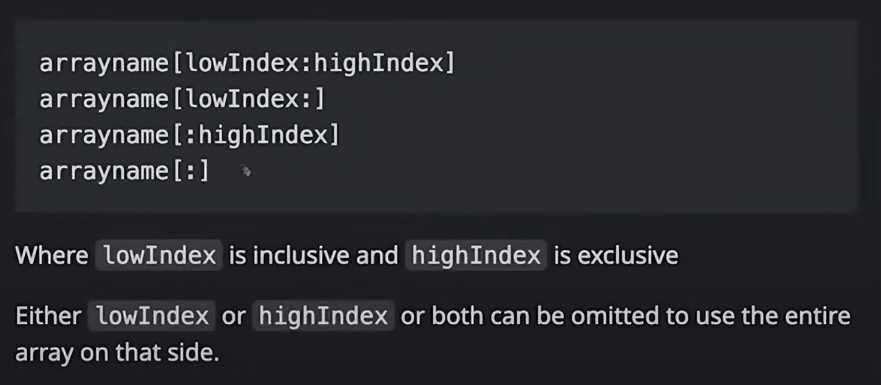
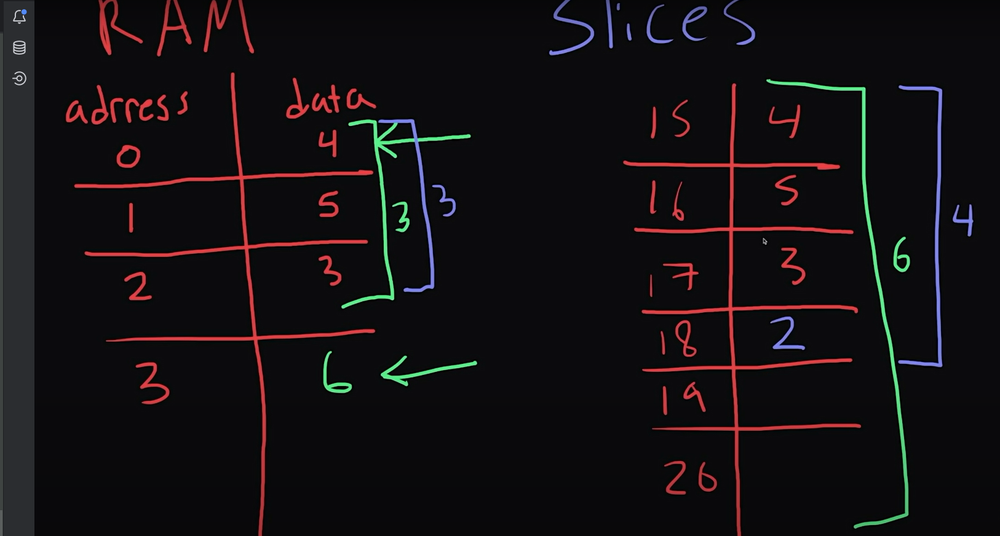
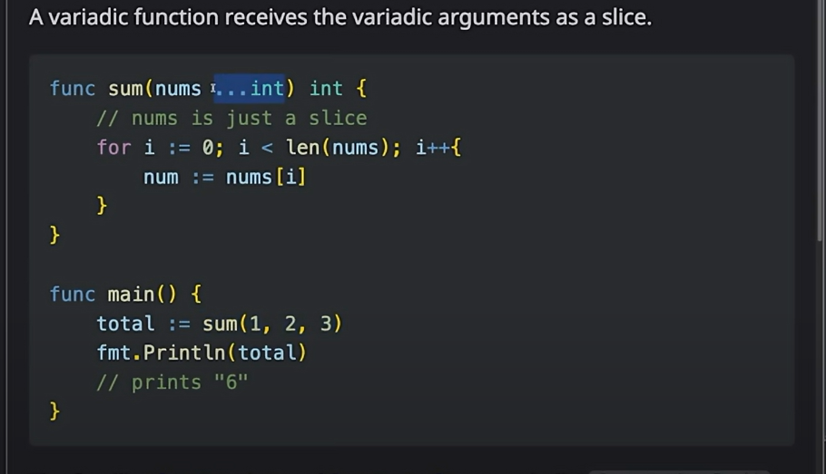
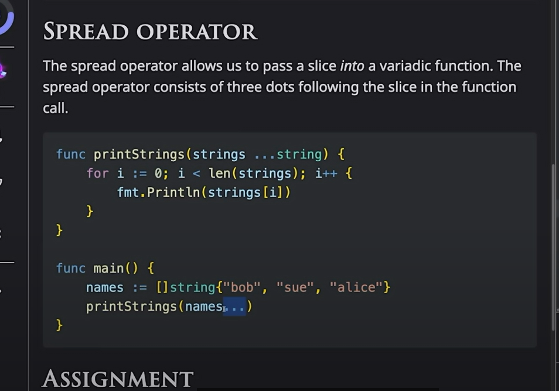
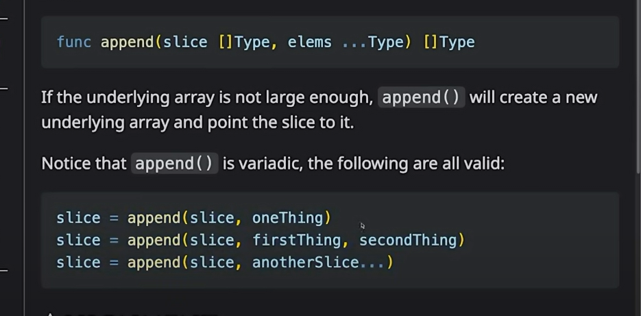
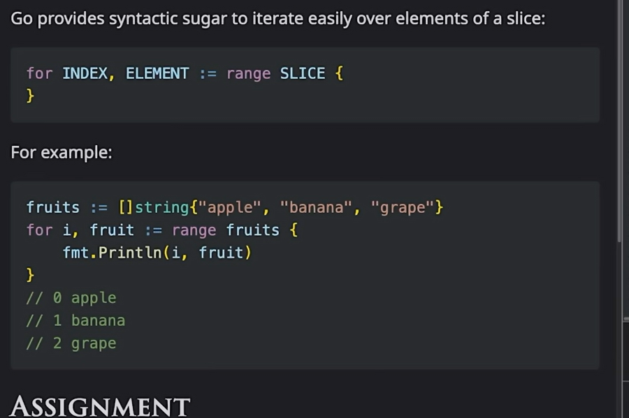
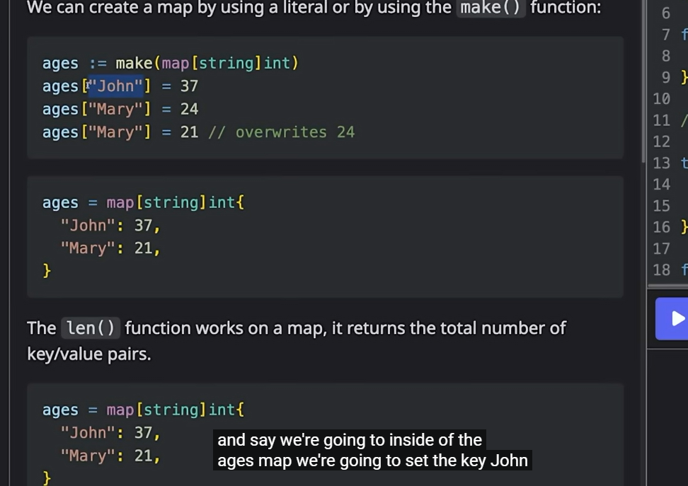

# GO

To pass Value by reference in Go, use ```&``` operator 
``` go
    var answer string
		fmt.Scan(&answer)
```

To define more than one variable in the same lin ==> 

```go
question, question2 := record[0], record[1] 
```

To ignore a variable u can use the magic key **_**, here u ignored the record[1]

```go
 question, _ := record[0], record[1] 
```

To loop through a list or array of items

```go
for i, record := range records {
		// define more than one variable in the same line
		question, _ := record[0], record[1]
		fmt.Println("%d. %s?\n", i+1, question)
		//to pass value with pointer (reference), we use the &
		var answer string
		fmt.Scan(&answer)
	}

```

i => indicates the index of the array, and record indicates the record itself

in Go each function, can have more than one return, and we need to handel this return (and listen if there is an error), as there is no throwh exception in Go.
Like here we are handling the exception.
```	go
f, err := os.Open(problemsFilename)
	// in go we should handle the error in each functio, as there is no throw try/catch checkes in Go, if we didn't handle this then a panic will happen
	// and may cos the program to stop.
	if err != nil {
		fmt.Printf("failed to open the file %s", err)
		return
	}
```

also for any IO operation, we need to handle closing the connection after u finish, So Go is giving us a magic key word to handle this once the operation is finished 
like the example here 
```go
f, err := os.Open(problemsFilename)
	// in go we should handle the error in each functio, as there is no throw try/catch checkes in Go, if we didn't handle this then a panic will happen
	// and may cos the program to stop.
	if err != nil {
		fmt.Printf("failed to open the file %s", err)
		return
	}
	// to make sure after we finish dealing with the file we close the file, and release it back to the IO system, also useful when error happen as it will also run if an error happen
	defer f.Close()

```

# Interfaces
In Go => it is just a collection of message interfaces, interfaces in Go are being implemented 
Imbecility , which mean, if u have an interface which has functions in it, and function that matches these interface  \
areas will implement it automatically  

``` go
 type shape interface {
    area() float64
    perimeter() float64
}

type rect struct{
    width, height float64
}

// function retlated to the rect, and it implements the interface automatically
func (r rect) area() float64{
    return r.width *  r.height;
}

// function retlated to the rect, and it implements the interface automatically
func (r rect) perimeter() float64{
    return 2* (r.width +  r.height);
}
```

In the example above the rect implemented the interface automatically as it has the same signature
which means the interface can be passed in the place where the rect is 

For a type to say it implements the interface, it has to have all 
  the interface methods

Interface methods can have parameters (named or unnamed)
```go
type Copier interface{
	// this function here, takes two stringes and return an int
	Copy(string, string) int
}

// another defination
type Copier interface{
// this function here, takes two stringes and return an int
    Copy(sourcefile string,destinationFile string) (bytesCopied int)
}
```

Type assertion => is where u can cast an interface back to a type 

```go
 type  shape interface {
	area() float64
}

type circle struct{
	raduis float64
}
// what we are doing here, we have an instance of shape (s), and want to cast it to circle
// if ok is true, then circle implements the shape interface
c,ok := s.(circle)
```

using switch patter to check the types 
```go
func PrintNumericValue(num interface{}){
	switch v:= num.(type)
	case int:
		fmt.PrintLn("it is an int")
	case string:
    fmt.PrintLn("it is an string")
	
	default:
		fmt.PrintF("it is not string nor an int")
}
```

```Char``` type in Go ==> ```rune```


another type use for If 

```
	if length := getLength(email); length < 1{
		fmt.Printf("it is one")
	}

```

how variables is being stored in memory in GO => in go variables are being passed by value not by reference


To solve this issue 


Functions in Go can have multiple return values => and in this point the seginature will be like this 

```
func getNames() (string, string)
{
	return "Mohamed", "Alaa"
}
```

in Go => when we don't do return in the function, it returns the default values for the variables based on its type => 

	```
		func getCordinates () (x,y int) // by doing this we gave a default values for x and y 
		{
			return // By doing this we return the x and y (even without writing them)
		}
	```	
it is equal to this function 


	```
		function getCordinates () (int, int){
			var x int
			var y int 
			return x, y
		}
	```


Early Return in Go => this happens when there is an error, and we want to return when this error happen (guard clauses)

	```
		func divide (dividened, divisor int) (int, error){
			if divisor == 0 {
				return 0, errors.New("Can't divide by zero")
			}
			return dividened/divisor,nil;
		}
	```

To return an error from a function ==> 
Error is noting than an interface that contains a method that returns a string
```go
 fmt.Errorf("error message");
```

we can define a global error message =>
```go
type userError struct{
	name string
}

// the userError Implements the Error Interface.
func (e userError) Error() string{
	// Sprintf => used to format the string
	return fmt.Sprintf("%v has a problem with their account",e.name)
}
```

For Loop in Go => 
```go
for initial ;condition ;increase{
	//Some code
}
for i:= 0;i < 100;i++{
	
}
```


******We don't have while loops in Go, we just have the for loop.
doing the same behaviour as while****** 
```go
plantHeight := 1;

// as long as the condition is true, the for loop will keep executing.
for plantHeight < 5{
	// do something.
}
```
To define an array in int

```go
var myInts [10]int ==> // it is also fixed size as C#

primes := [6]int{1,2,3,4,5,6} 

```

Slice is just unlimited array size, **it is a reference types**
```go
 var myMessages = [3] string{"Mohamed","Alaa","Saad"}
 
 mySlice := myMessages[0:2] 
 // mySlice => {"Mohamed","Alaa"}
```
Take values form array to Slice 


AS slices are stored in a contiguous store in memory, 
when we increase the size of the slice we copy all the data from one place to another 
that fit the new addition


To create a slice, without having an array at the beginning => 

```go
//func make ([]T, len, cap)
// Capacity is the array Length we have under the hood
mySlice := make([]int,5,10)

// we can ignore the capacity input 
mySlice := make([]int,5)

// u can initialize the slice with values 

mySlice := []string {"I","love","Go"} ==> we created it with a 3 items

// To return the length of a slice 
len(myslice) ==> will return the length 
```

**Variadic functions**, the difference will be in the caller itself



**Spread operator**,  



**Append**, To add new thing to the end of the Slice, we use the append function



**how to iterate on a slice** 



**Dictionaries == maps in GO**



Go routines 
Go channels

